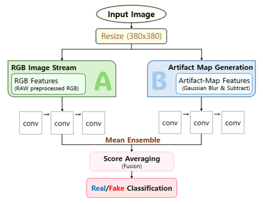
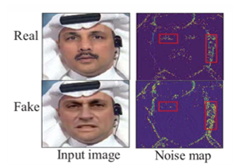
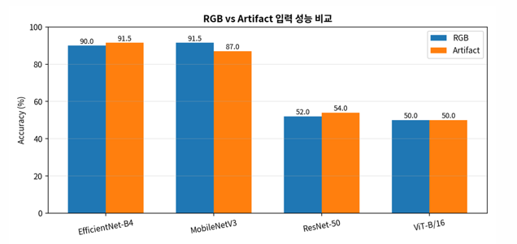
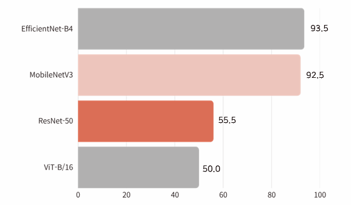
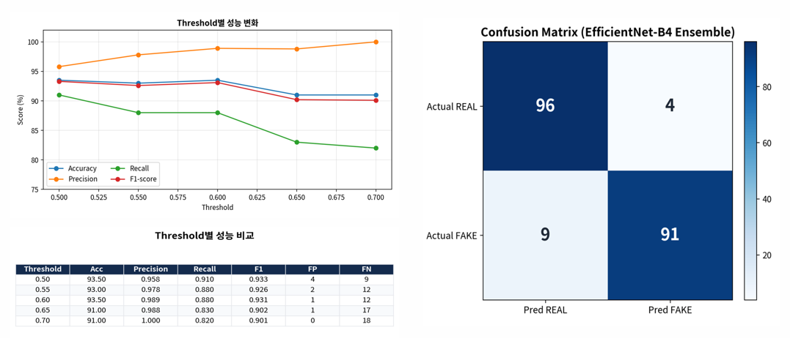
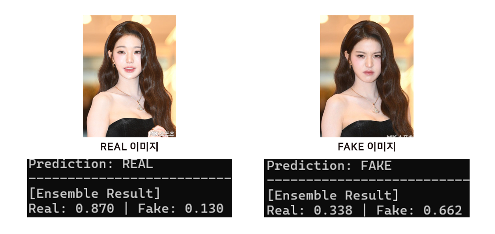

# RGB와 Artifact Map을 활용한 CNN 기반 딥페이크 탐지 모델

## CONTENTS

1. 프로젝트 개요
2. 데이터셋
3. 제안 방법
4. 실험 설정
5. 실험 결과
6. 한계점 및 향후 개선 방향
7. 결론

---

## 1. 프로젝트 개요

본 프로젝트는 **RGB 이미지와 Artifact Map을 활용하여 Real 이미지와 Fake 이미지를 분류하는 딥페이크 탐지 프로젝트**이다.

- 딥페이크 기술은 가짜 뉴스, 얼굴 도용, 명예훼손, 사생활 침해 등 다양한 사회적 문제를 유발할 수 있다.
- 딥페이크 이미지의 품질이 향상되면서 사람의 눈으로 Real/Fake를 구분하는 데 한계가 있다.
- 본 프로젝트에서는 딥러닝 모델을 활용하여 딥페이크 이미지를 자동으로 탐지하고자 하였다.
- RGB 이미지, Artifact Map, RGB + Artifact 앙상블 방식을 비교하였다.
- EfficientNet-B4, MobileNetV3, ResNet-50, ViT-B/16 모델을 비교하여 최종 모델을 선정하였다.

### 프로젝트 목표

- Real/Fake 이미지 분류 모델 구현
- RGB 이미지 기반 딥페이크 탐지 성능 확인
- Artifact Map 기반 딥페이크 탐지 성능 확인
- RGB와 Artifact Map을 결합한 앙상블 방식 적용
- 모델별 성능 비교를 통한 최종 모델 선정

### 프로젝트 전체 흐름도

아래 그림은 입력 이미지를 380×380 크기로 조정한 뒤, RGB 이미지 특징 추출 과정과 Artifact Map 생성 과정을 거쳐 두 결과를 앙상블하여 Real/Fake를 분류하는 전체 흐름을 나타낸다.



---

## 2. 데이터셋

본 프로젝트에서는 공개 데이터셋 기반의 원본 이미지를 수집하고, Face Swap 기반 딥페이크 이미지를 생성하여 데이터셋을 구성하였다.

| 구분 | 개수 |
|---|---:|
| Real 이미지 | 500장 |
| Fake 이미지 | 500장 |
| 전체 데이터 | 1000장 |

### 데이터 구성

- 공개 데이터셋 기반 원본 이미지 수집
- Nano Banana2를 활용한 Face Swap 기반 딥페이크 이미지 생성
- Real 이미지 500장, Fake 이미지 500장으로 구성
- Excel을 활용하여 원본 이미지, 딥페이크 이미지, 프롬프트 정보 정리
- 워터마크 및 로고를 수작업으로 제거하여 외부 요소가 모델 학습에 영향을 주지 않도록 처리

```text
Train : Validation = 8 : 2
```

> 전체 이미지 데이터는 용량 문제로 GitHub 저장소에 포함하지 않았다.

---

## 3. 제안 방법

본 프로젝트에서는 딥페이크 탐지 성능을 비교하기 위해 **RGB 이미지 기반 탐지**, **Artifact Map 기반 탐지**, **RGB + Artifact 앙상블** 방식을 사용하였다.

### 3.1 RGB 이미지 기반 탐지

RGB 이미지는 일반적인 원본 이미지 입력 방식이다.

- 원본 RGB 이미지를 모델 입력으로 사용
- 얼굴의 색상, 형태, 질감 등 전체적인 시각 정보 학습
- Real/Fake 이진 분류 수행
- RGB 이미지 기반 모델별 탐지 성능 비교

---

### 3.2 Artifact Map 기반 탐지

Artifact Map은 원본 이미지와 Gaussian Blur 이미지의 차이를 이용하여 생성하였다.

```text
Artifact Map = | Original Image - Gaussian Blurred Image |
```

- 원본 이미지: 얼굴 구조, 색상, 조명, 피부 질감, 경계선, 노이즈 포함
- Gaussian Blur 이미지: 얼굴 구조, 색상, 조명 등 부드러운 정보 중심으로 표현
- 원본 이미지에서 Blur 이미지를 빼면 피부 질감, 경계선, 노이즈와 같은 고주파 특징이 강조됨
- RGB 이미지에서 놓칠 수 있는 미세한 딥페이크 조작 흔적을 보완할 수 있음

### Artifact Map 예시

아래 이미지는 Real/Fake 이미지와 Noise Map을 비교한 예시이다.

본 프로젝트의 Artifact Map은 원본 이미지와 Gaussian Blur 이미지의 차이를 이용하여 생성하였으며, Noise Map처럼 이미지의 미세한 차이와 조작 흔적을 확인하는 데 도움을 준다.




---

### 3.3 RGB + Artifact 앙상블

RGB 모델과 Artifact 모델의 예측 결과를 결합하여 최종 예측을 수행하였다.

```text
Final Prediction = RGB Prediction × 0.5 + Artifact Prediction × 0.5
```

- RGB 모델과 Artifact 모델의 예측 결과를 5:5 비율로 결합
- 단일 입력 방식의 한계를 보완
- RGB 정보와 Artifact 정보를 함께 활용하여 탐지 안정성 향상
- 모델별 최종 성능 비교를 통해 가장 적합한 모델 선정

---

## 4. 실험 설정

본 프로젝트에서는 CNN 기반 모델과 Transformer 기반 모델을 함께 비교하였다.

### 비교 모델

| 모델 | 설명 |
|---|---|
| EfficientNet-B4 | 효율적인 특징 추출이 가능한 CNN 기반 모델 |
| MobileNetV3 | 경량화된 CNN 모델 |
| ResNet-50 | 잔차 연결을 사용하는 대표적인 CNN 모델 |
| ViT-B/16 | Transformer 기반 이미지 분류 모델 |

### 하이퍼파라미터

| 항목 | 설정값 |
|---|---|
| Input Resolution | 380 × 380 |
| Batch Size | 8 |
| Epoch | 10 |
| Early Stopping | patience 4 |
| Threshold | 0.5 |
| Checkpoint 기준 | Min Validation Loss |
| Ensemble Weight | RGB 0.5 : Artifact 0.5 |

---

## 5. 실험 결과

본 프로젝트에서는 RGB 단일 입력, Artifact Map 단일 입력, RGB + Artifact 결합 입력 방식으로 실험을 진행하였다.

---

### 5.1 RGB / Artifact 단일 입력 성능 비교

RGB 입력과 Artifact Map 입력을 각각 사용하여 모델별 탐지 성능을 비교하였다.

| 모델 | RGB 정확도 | Artifact 정확도 |
|---|---:|---:|
| EfficientNet-B4 | 90.00% | 91.50% |
| MobileNetV3 | 91.50% | 87.00% |
| ResNet-50 | 52.00% | 54.00% |
| ViT-B/16 | 50.00% | 50.00% |

- RGB 입력 기반 실험 결과: MobileNetV3가 가장 높은 성능을 보임
- Artifact Map 입력 기반 실험 결과: EfficientNet-B4가 가장 높은 성능을 보임
- 입력 형태에 따라 모델별 성능 차이가 발생함



---

### 5.2 RGB + Artifact 결합 입력 성능 비교

RGB 모델과 Artifact 모델의 예측 결과를 결합하여 최종 성능을 비교하였다.

| 모델 | 정확도 |
|---|---:|
| EfficientNet-B4 | 93.5% |
| MobileNetV3 | 92.5% |
| ResNet-50 | 55.5% |
| ViT-B/16 | 50.0% |

```text
최종 결과:
EfficientNet-B4 > MobileNetV3 > ResNet-50 > ViT-B/16
```

- EfficientNet-B4가 93.5%로 가장 높은 정확도를 보임
- MobileNetV3는 경량 모델임에도 92.5%의 높은 성능을 보임
- ResNet-50과 ViT-B/16은 본 실험 조건에서 상대적으로 낮은 성능을 보임
- RGB와 Artifact 정보를 결합했을 때 EfficientNet-B4가 가장 안정적인 결과를 보임



---

### 5.3 Threshold 및 Confusion Matrix 분석

Threshold는 Real/Fake를 분류하기 위한 기준값으로 사용하였다.

- Threshold 값: 0.5
- F1-score 기준 Threshold 0.50에서 가장 높은 성능을 보임
- Real 100장 중 96장, Fake 100장 중 91장을 정답으로 분류
- Accuracy뿐만 아니라 Precision, Recall, F1-score와 오류 유형을 함께 확인함



---

### 5.4 모델 실행 결과

학습된 모델에 Real 이미지와 Fake 이미지를 입력하여 실제 분류 결과를 확인하였다.

- Real 이미지 입력 시 Real로 예측하는지 확인
- Fake 이미지 입력 시 Fake로 예측하는지 확인
- 학습된 모델이 실제 이미지 입력에 대해 분류를 수행할 수 있음을 확인



---

### 5.5 결과 분석

실험 결과, EfficientNet-B4가 최종 성능과 입력별 안정성 측면에서 가장 우수하였다.

- EfficientNet-B4는 RGB + Artifact 결합 입력에서 93.5%의 정확도를 기록하였다.
- Artifact Map은 RGB 이미지에서 놓칠 수 있는 미세한 조작 흔적을 보완하는 역할을 하였다.
- MobileNetV3는 경량 모델임에도 높은 성능을 보여 활용 가능성을 확인하였다.
- ResNet-50과 ViT-B/16은 본 실험 조건에서 상대적으로 불안정한 결과를 보였다.
- 최종적으로 EfficientNet-B4를 딥페이크 탐지에 가장 적합한 모델로 선정하였다.

---

## 팀원별 역할

| 이름 | 역할 |
|---|---|
| 윤혁준 | 이미지 데이터셋 탐색, 딥페이크 이미지 생성 200개, PPT 제작, EfficientNet 베이스라인 모델 정확도 측정 및 성능 평가, 모델 성능 비교 분석, 프로젝트 결과 표 및 그래프 생성 |
| 박민혁 | 베이스라인 모델 학습 및 적용, 메인 코드 구축 및 총괄, 딥페이크 이미지 생성 150개, EfficientNet 정확도 측정 및 성능 평가, 모델 성능 비교 분석, PPT 제작 |
| 김나현 | 최신 베이스라인 코드 탐색, 딥페이크 이미지 생성 150개, 이미지 엑셀 정리, 사이트 구축 시도, EfficientNet 정확도 측정 및 성능 평가, 플로우차트 생성, 프로젝트 결과 표 및 그래프 생성, PPT 제작 |

---

## 6. 한계점 및 향후 개선 방향

본 프로젝트는 제한된 데이터와 실험 환경에서 진행되었기 때문에 몇 가지 한계점이 존재한다.

### 6.1 한계점

1. 데이터셋의 규모가 제한적이다.
2. Fake 데이터가 특정 생성 방식에 치우칠 수 있다.
3. Artifact Map은 조명, 화장, 피부 질감, 압축 노이즈까지 함께 반영할 수 있다.
4. 로고나 워터마크가 특정 클래스에만 존재할 경우 모델이 얼굴 특징이 아닌 외부 요소를 학습할 위험이 있다.
5. 영상 기반 딥페이크의 시간적 특징은 분석하지 못하였다.

### 6.2 향후 개선 방향

1. 다양한 딥페이크 생성 방식의 데이터를 추가한다.
2. 외부 데이터셋을 활용하여 일반화 성능을 검증한다.
3. 얼굴 crop 및 alignment를 적용하여 얼굴 영역 중심의 탐지 성능을 개선한다.
4. 주파수 영역 분석을 추가하여 Artifact 특징을 더 정밀하게 분석한다.
5. 영상 기반 temporal artifact 분석으로 확장한다.
6. 경량 모델을 활용하여 실제 서비스 적용 가능성을 검토한다.

---

## 7. 결론

본 프로젝트에서는 RGB 이미지와 Artifact Map을 활용하여 CNN 기반 딥페이크 탐지 모델의 성능을 비교하였다.

- RGB 입력과 Artifact Map 입력은 서로 다른 특징을 학습하였다.
- Artifact Map은 딥페이크 이미지의 미세한 조작 흔적을 보완하는 데 도움을 주었다.
- RGB와 Artifact Map을 결합한 앙상블 방식에서 EfficientNet-B4가 가장 높은 성능을 보였다.
- 최종적으로 EfficientNet-B4는 93.5%의 정확도를 기록하였다.
- 이를 통해 딥페이크 탐지에서는 RGB 이미지 정보뿐만 아니라 Artifact 정보를 함께 활용하는 것이 성능 향상에 도움이 될 수 있음을 확인하였다.
